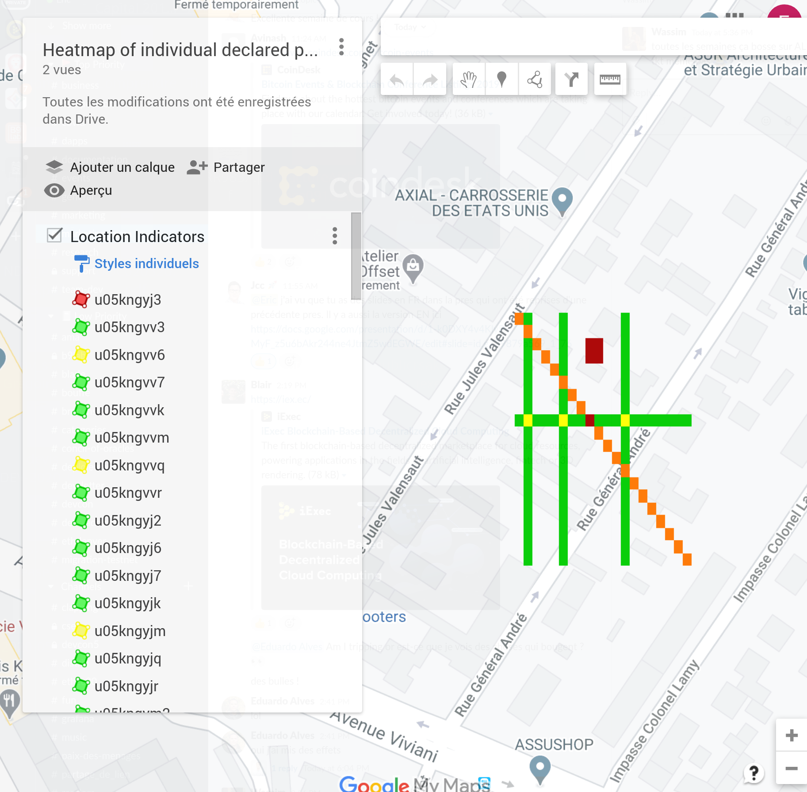

# PANDAPP: PRIVACY PRESERVING DATA CONTRIBUTION 

A voluntary service to allow individuals to share their data to fight the pandemic spread.
Individual keeps the control of its data and its usage by third party. 
The solution leverages blockchain, data encryption and Trusted Execution Environments.
 
## The problem 
TDB


#How it works   
TDB

 
# Dataset generation
TDB

# Applications

## Heatmap

The application generates an heatmap data collected from volunteers, 
```python3 app_heatmap.py
Filename for dataset is tracks_heatmap.data
output file is output_heatmap.csv
Total execution time: 0.0004177093505859375 seconds
```
then create the kml files  in a second program 

* Geohask2kml creates kml file from dataset.
   * input : geohash dict file
   * output : heatmap in kml file    

```python3 geohash2kml.py output_heatmap.csv heatmap
....
generate heatmap_simple.kml
generate heatmap.kml
```
You can charge the kml file generated in "Google my maps" 

The green line means someone was moving during the time interval 
The red point means someone was standing at the same place during the time interval 

### Limitation
TBD

## Social distance

```python3 app_socialdistance.py 1
Filename for dataset is tracks_socialdistance.data
....
*************RESULT***************
 you have met  1  person(s) declared ill
 and  0  person(s) not declared
Total execution time: 0.0002472400665283203 seconds
```

# Links and reference 

* Geohash map
```http://geohash.gofreerange.com/```

* iExec infrastructure
```docs.iex.ec```

* Précision geohash


| len  | Geohash length  | Cell width heigh  |
|------|-----------------|-------------------|
| 1    | ≤ 5,000km       | ×5,000km          |
| 2    | ≤ 1,250km       | ×	625km        | 
| 3    | ≤ 156km	     | ×	156km        |
| 4    | ≤ 39.1km	     | ×	19.5km       |
| 5    | ≤ 4.89km	     | ×	4.89km       |
| 6    | ≤ 1.22km	     | ×	0.61km       |
| 7    | ≤ 153m	         | ×	153m         |
| 8    | ≤ 38.2m	     | ×	19.1m        |
| 9    | ≤ 4.77m	     | ×	4.77m        |
| 10   | ≤ 1.19m	     | ×	0.596m       |
| 11	 |  149mm	     | ×	149mm        |
| 12   | ≤ 37.2mm	     | ×	18.6mm       |
